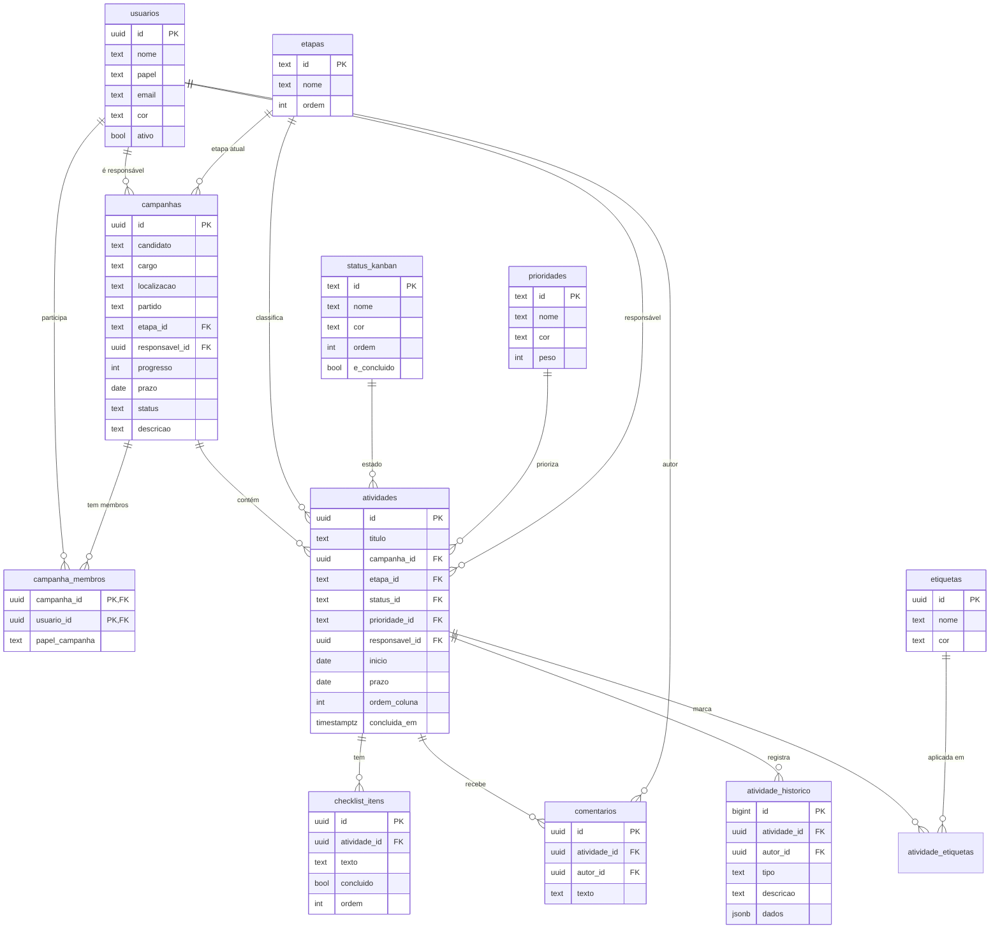

# Arquitetura de Dados — Sistema de Gestão de Campanhas (Dual)

> Backend do **CampoGestão** (o protótipo em `/prototype`), construído sobre a
> **mesma estrutura e convenções do sistema existente da Dual** (o *Sistema de
> Contatos Eleitorais*, em `/2026`), para manter tudo organizado e coerente.

---

## 1. Alinhamento com o sistema existente

O sistema de Contatos Eleitorais já roda com uma stack definida. O novo sistema
de gestão **reaproveita as mesmas escolhas**:

| Aspecto | Sistema de Contatos (existente) | Novo sistema de Gestão |
|---|---|---|
| Banco | PostgreSQL 16 | PostgreSQL 16 |
| API | FastAPI + psycopg2 + pydantic | FastAPI + psycopg2 + pydantic |
| Orquestração | Docker Compose | Docker Compose (novo serviço) |
| Nomenclatura | pt-BR (`contatos`, `criado_em`) | pt-BR (`campanhas`, `atividades`) |
| Timestamps | `criado_em` / `atualizado_em` `TIMESTAMPTZ DEFAULT NOW()` | idem, + trigger de touch |
| Enums | `CHECK (status IN (...))` | `CHECK` p/ simples; tabela de apoio p/ enums com cor/ordem |
| Dados flexíveis | `JSONB` (`vcf_payload`) | `JSONB` (`atividade_historico.dados`) |
| Dashboards | View `resumo_contatos` → `/stats` | Views `vw_dashboard`, `vw_campanha_resumo`, `vw_carga_equipe` |
| Config | variáveis de ambiente (`DB_HOST`…) | idem |

**DDL completo e executável:** [`db/init.sql`](db/init.sql) (roda automaticamente
na primeira inicialização do volume do Postgres, igual ao `init.sql` do `/2026`).

---

## 2. Diagrama de entidades (ER)



---

## 3. Tabelas

### Apoio (lookup)
| Tabela | Descrição | Chave |
|---|---|---|
| `etapas` | 7 etapas do pipeline (Planejamento → Encerramento), ordenadas | `id` slug |
| `status_kanban` | 5 colunas do Kanban, com cor, ordem e flag `e_concluido` | `id` slug |
| `prioridades` | Alta / Média / Baixa, com cor e `peso` | `id` slug |
| `etiquetas` | Etiquetas livres, com cor | `id` uuid |

### Núcleo
| Tabela | Descrição | Relações principais |
|---|---|---|
| `usuarios` | Equipe da agência (+ campos reservados p/ auth futura) | — |
| `campanhas` | Campanhas políticas | → `etapas`, `usuarios` (responsável) |
| `campanha_membros` | Equipe alocada por campanha (N:N) | `campanhas` ↔ `usuarios` |
| `atividades` | Tarefas (cards do Kanban / barras da timeline) | → `campanhas`, `etapas`, `status_kanban`, `prioridades`, `usuarios` |
| `atividade_etiquetas` | Etiquetas por atividade (N:N) | `atividades` ↔ `etiquetas` |
| `checklist_itens` | Itens de checklist da atividade | → `atividades` |
| `comentarios` | Comentários da atividade | → `atividades`, `usuarios` |
| `atividade_historico` | Log de eventos (status, prazo, edições) | → `atividades`, `usuarios` |

### Regras embutidas no banco
- **`atualizado_em`** mantido por trigger (`fn_touch_atualizado_em`) em `usuarios`, `campanhas`, `atividades`.
- **`concluida_em`** preenchido/limpo automaticamente quando a atividade entra/sai do status terminal (`fn_atividade_concluida`).
- **Atraso** = atividade não concluída com `prazo < hoje` (calculado nas views, nunca duplicado como coluna).

---

## 4. Views de dashboard (equivalem ao `resumo_contatos`)

| View | Para que serve (tela do protótipo) |
|---|---|
| `vw_dashboard` | Cards do topo: campanhas ativas, em andamento, atrasadas, entregas hoje |
| `vw_campanha_resumo` | Por campanha: totais, atrasadas, em revisão, **risco** (🟢🟡🔴) |
| `vw_carga_equipe` | Por pessoa: tarefas, atrasadas, campanhas (tela Equipe) |

O **risco** usa exatamente a regra do protótipo (≥2 atrasadas → vermelho; 1 atrasada
ou ≥3 vencendo em 4 dias → amarelo; senão verde), calculado no banco.

---

## 5. Mapeamento protótipo → banco

O estado hoje vive em `prototype/js/data/mock.js` (`App.data`). Cada estrutura vira uma tabela:

| Protótipo (`App.data`) | Tabela | Observações |
|---|---|---|
| `stages[]` | `etapas` | slugs idênticos (`planejamento`…) |
| `statuses[]` | `status_kanban` | ids idênticos (`backlog`…`done`) |
| `priorities[]` | `prioridades` | ids idênticos (`alta`/`media`/`baixa`) |
| `labels[]` | `etiquetas` | por nome |
| `users[]` | `usuarios` | `role`→`papel`, `color`→`cor` |
| `campaigns[]` | `campanhas` (+ `campanha_membros`) | `teamIds[]`→`campanha_membros`; `risk` deixa de ser campo e passa a ser calculado |
| `tasks[]` | `atividades` (+ filhas) | `labels[]`→`atividade_etiquetas`; `checklist[]`→`checklist_itens`; `comments[]`→`comentarios`; `history[]`→`atividade_historico`; `startDate`→`inicio`; `dueDate`→`prazo` |

> **O banco de produção começa ZERADO** — sem usuários e sem campanhas. O
> mapeamento acima é a estrutura; a criação é feita do zero pela agência
> (primeiro admin → demais usuários → campanhas → atividades).
> O gerador `db/gen_seed.mjs` existe apenas para **popular um ambiente de teste**
> com os dados fictícios do protótipo, e **não** é carregado automaticamente.

---

## 6. API REST proposta (FastAPI) — próxima etapa

Mesmo estilo do `api/main.py` do sistema existente (FastAPI, CORS, `get_conn()`, pydantic).

```
GET    /health
GET    /setup/status                   # precisa criar o 1º admin?
POST   /auth/bootstrap                 # cria o 1º admin (só com banco zerado)
POST   /usuarios                       # (admin|gestor) criar usuário
GET    /dashboard                      # vw_dashboard
GET    /meta                           # etapas + status + prioridades + etiquetas

# Campanhas
GET    /campanhas            ?status&etapa&responsavel&busca
POST   /campanhas
GET    /campanhas/{id}                  # inclui resumo (vw_campanha_resumo) + membros
PUT    /campanhas/{id}
DELETE /campanhas/{id}
GET    /campanhas/{id}/atividades
GET    /campanhas/{id}/equipe
PUT    /campanhas/{id}/membros          # define equipe

# Atividades
GET    /atividades          ?campanha&responsavel&status&prioridade&etiqueta&de&ate
POST   /atividades
GET    /atividades/{id}                 # com etiquetas, checklist, comentários, histórico
PUT    /atividades/{id}
PATCH  /atividades/{id}/status          # mover no Kanban (grava histórico)
DELETE /atividades/{id}
POST   /atividades/{id}/comentarios
POST   /atividades/{id}/checklist
PATCH  /checklist/{item_id}             # marcar/desmarcar

# Equipe
GET    /usuarios                        # com vw_carga_equipe
GET    /usuarios/{id}
```

---

## 7. Estrutura de pastas do backend

```
gestao/
├── DATA_ARCHITECTURE.md      # este documento
├── db/
│   ├── init.sql              # schema + dados de referência (auto na 1ª subida)
│   └── gen_seed.mjs          # OPCIONAL: dados fictícios p/ teste (não auto-carrega)
├── api/
│   ├── main.py               # FastAPI
│   ├── db.py                 # conexão / helpers
│   ├── auth.py               # PBKDF2 + JWT HS256 (stdlib)
│   ├── models.py             # schemas pydantic
│   ├── requirements.txt
│   └── Dockerfile
├── docker-compose.yml        # postgres (gestao, separado) + gestao-api
└── .env.example
```

---

## 8. Decisões que valem confirmar antes de eu programar a API

1. **Stack** — FastAPI + PostgreSQL 16 + Docker, igual ao sistema existente. ✔ (assumido)
2. **IDs** — `UUID` nas entidades (campanhas, atividades, usuários) e slugs de texto nas tabelas de apoio. Fácil de mesclar com o `/2026` depois.
3. **Autenticação** — fora do escopo desta fase (como no protótipo). Já deixei `senha_hash`/`perfil_acesso` reservados em `usuarios` para plugar depois (JWT).
4. **Banco separado** ✔ (decidido) — Postgres próprio (`gestao`), isolado do sistema de contatos, com opção de unificar no futuro.
5. **Banco zerado** ✔ (decidido) — sem usuários/campanhas; primeiro admin criado do zero (`.env` ADMIN_* ou `POST /auth/bootstrap`).
